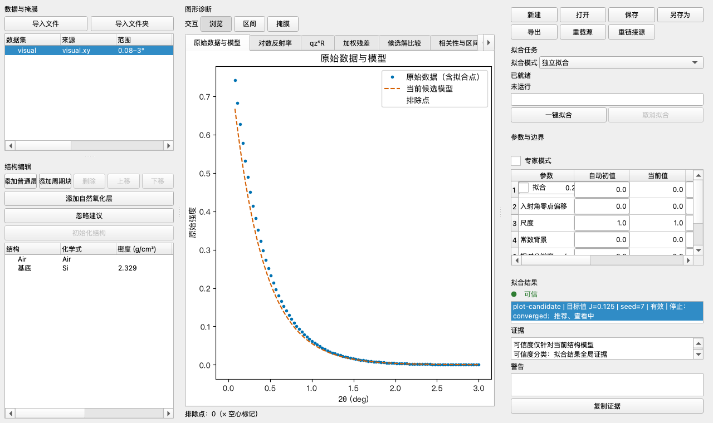

# XRR Fitter

XRR Fitter is a desktop application for fitting X-ray reflectivity (XRR)
measurements to layered thin-film structure models. It provides an interactive
PySide6 GUI for building structures, running global-then-local optimization,
and quantifying parameter uncertainty.



## Features

- Interactive structure editor for layers, periodic stacks, gradients, and the
  substrate backing, with real-time reflectivity and SLD-profile plots.
- Global screening followed by local least-squares refinement with checkpointed,
  resumable fits.
- Uncertainty analysis: bootstrap resampling, MCMC sampling, and parameter
  correlation diagnostics.
- Joint fitting across multiple datasets with shared parameters.
- Filename-driven batch fitting and deterministic project/export round-trips.

## Requirements

- Python 3.12 (`>=3.12,<3.13`)
- macOS on Apple Silicon (arm64)

Runtime dependencies (numpy, scipy, periodictable, pandas, xlsxwriter,
matplotlib, PySide6) are declared in `pyproject.toml` and pinned in
`requirements-macos-arm64-py312.lock`.

## Installation

```bash
python3.12 -m venv .venv
source .venv/bin/activate
pip install -r requirements-macos-arm64-py312.lock
pip install .
```

## Usage

Launch the desktop shell:

```bash
xrr-fitter            # installed entry point
python -m xrr_fitter  # module entry point
python -m xrr_fitter --help
```

Sample projects and data live in `examples/` (`single-layer`,
`mo-si-periodic`).

## Public API

`xrr_fitter.api` is the only supported Python API. Everything else under
`xrr_fitter` is internal and may change without notice.

## Development

```bash
pip install -e '.[test]'
python tools/verify.py MODE      # quality | tools | unit | gui | integration | ...
python tools/check_radon.py      # complexity policy
```

`tools/verify.py` runs the repository's verification gates; the same gates run
in CI (`.github/workflows/verify.yml`). Architecture, dependency, and public-API
rules are enforced under `tests/architecture/`. See `AGENTS.md` for repository
conventions.

## Documentation

- `docs/user-guide.md` — end-user workflows
- `docs/algorithm.md` — fitting algorithm and physics
- `docs/architecture/r23-clean-break.md` — architecture and dependency graph

## License

License to be determined. Until a license is added, all rights are reserved by
the authors.
